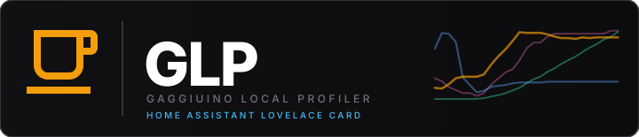

<p align="center">
  
</p>

<p align="center">
  <a href="https://github.com/mxkissnr/glp-lovelace-card/releases">
    
  </a>
  
  
  
  
</p>

<p align="center">
  Custom Lovelace card for <a href="https://github.com/mxkissnr/gaggiuino-local-profiler">Gaggiuino Local Profiler</a>.<br/>
  Displays last shot, preheat progress, live brewing state and sync time — all from the <a href="https://github.com/mxkissnr/gaggiuino-profiler-integration">GLP HA Integration</a>.
</p>

---

## Prerequisites

- [Gaggiuino Local Profiler](https://github.com/mxkissnr/gaggiuino-local-profiler) add-on installed
- [GLP Integration](https://github.com/mxkissnr/gaggiuino-profiler-integration) installed and configured

## Installation via HACS

1. In HACS → Frontend → ⋮ → Custom repositories → add `mxkissnr/glp-lovelace-card` (category: **Lovelace**)
2. Download the card
3. Add a manual resource or let HACS handle it

## Configuration

Minimal (auto-detects the integration):
```yaml
type: custom:glp-card
```

Full config:
```yaml
type: custom:glp-card
glp_url: http://homeassistant.local:8099          # optional — adds "GLP öffnen" link
title: Gaggiuino                                  # optional header title
entity_prefix: sensor.gaggiuino_local_profiler_   # optional — auto-detected if omitted
switch_entity: switch.espresso_plug               # optional — power toggle + collapse when off
```

### Options

| Option | Description | Default |
|---|---|---|
| `entity_prefix` | Prefix shared by all GLP sensor entities — auto-detected if omitted | *(auto)* |
| `switch_entity` | HA switch entity ID for the smart plug — auto-detected from integration v1.4.1+; only set manually if using an older integration | *(auto)* |
| `glp_url` | URL to the GLP web interface (adds an "open" link) | *(none)* |
| `title` | Card header title | `Gaggiuino` |

## What it shows

- Machine online / error / brewing status
- Preheat progress bar + countdown while machine warms up; "Brühbereit ☕" badge when ready
- Live "Bezug läuft …" banner when a shot is in progress
- Last shot: profile name, coffee bean, score, duration, yield, brew ratio, avg pressure
- Shots pulled today
- Time since last sync with the Gaggiuino controller

## Entities used

The card reads the following entities (with default `entity_prefix`):

| Entity | Description |
|---|---|
| `binary_sensor.gaggiuino_local_profiler_brewing` | Live brewing state |
| `binary_sensor.gaggiuino_local_profiler_preheat_ready` | Machine warmed up |
| `sensor.gaggiuino_local_profiler_machine_status` | online / error |
| `sensor.gaggiuino_local_profiler_preheat_elapsed` | Warmup elapsed (s) |
| `sensor.gaggiuino_local_profiler_preheat_remaining` | Warmup remaining (s) |
| `sensor.gaggiuino_local_profiler_last_shot_profile` | Profile name |
| `sensor.gaggiuino_local_profiler_last_shot_coffee` | Coffee bean |
| `sensor.gaggiuino_local_profiler_last_shot_score` | Shot score |
| `sensor.gaggiuino_local_profiler_last_shot_duration` | Duration (s) |
| `sensor.gaggiuino_local_profiler_last_shot_yield` | Yield (g) |
| `sensor.gaggiuino_local_profiler_last_shot_brew_ratio` | Brew ratio |
| `sensor.gaggiuino_local_profiler_last_shot_avg_pressure` | Avg pressure (bar) |
| `sensor.gaggiuino_local_profiler_shots_today` | Shots today |
| `sensor.gaggiuino_local_profiler_last_sync` | Last sync timestamp |

All entities are provided by the [GLP Integration](https://github.com/mxkissnr/gaggiuino-profiler-integration).

---

<p align="center">
  <a href="https://github.com/mxkissnr/gaggiuino-local-profiler/wiki">📖 Documentation (Wiki)</a> ·
  <a href="https://github.com/mxkissnr/gaggiuino-local-profiler">🔧 GLP Add-on</a> ·
  <a href="https://github.com/mxkissnr/gaggiuino-profiler-integration">⚡ GLP Integration</a> ·
  <a href="https://github.com/mxkissnr/glp-lovelace-card/issues">🐛 Issues</a>
</p>

---

## License

GPL-3.0 © 2024–2026 mxkissnr — free to use, fork and modify; any derivative work must remain open source under the same license. Commercial use is not permitted.

## Acknowledgements

Inspired by [BeanConqueror](https://github.com/graphefruit/beanconqueror) by graphefruit — a fantastic open-source coffee tracking app that pioneered many of the ideas around shot logging and coffee library management that influenced this project.

---

<p align="center">
  <sub>Built with <a href="https://claude.ai/code">Claude Code</a> by Anthropic</sub>
</p>
